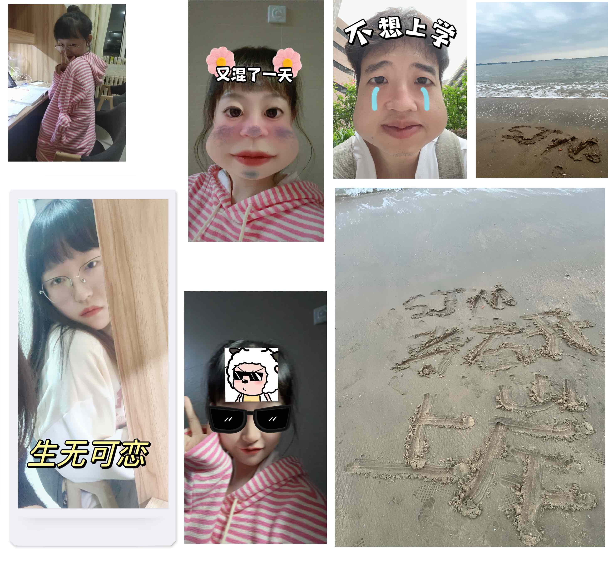

这一年里我们经历了好多，是我们一起变好的一年，在这一年里咱俩终于都上岸了，顺利成为了一名研究生，希望我们可以越来越好，永远幸福下去。宝贝，四周年快乐！

## 再出发

上半年的主题还是围绕着考研展开，我们都在朝着未来努力，幸好所收获的对得起了我们的努力。

## 新年到，过年好
一转眼又到过年，今年和往年有什么区别呢？当然就是时隔好多年，又可以放炮啦，今年特别的有年味，记得咱们30晚上去玩加特林，玩了个爽，还有别的炮，真的是特别特别尽兴。还记得我们去看烟火嘛，冻的要死，咱们硬是站了一晚上看了固阳的烟火，当看到漫天绚丽的烟火，心头暗喜，咱们又多了属于咱们的美好记忆。

当然，除了烟花外，我们还玩了许多其他有趣的事情，我们去抓了娃娃，我们去看了元宵节的花灯，又一次挑战了滑旱冰（虽然还是滑得不好。总之，这是一个特别有年味的新年啦，过年好呀！

## 爱上马鞍山
[旅行Vlog](https://aimmeng-life.wistia.com/medias/dz0zsp5hj4)

终于我们又去玩啦，这一次你终于考完了所有的试，可以心无旁骛的快乐玩耍啦。这一次我们主要去了马鞍山，风景真的好美呀，就是虫虫有一点多，看到了你的养蜂人服装哈哈哈哈。接着还收到了你送我的花花，好好看的花花反观我，我的选花品味真的需要好好提高一下了QAQ

我们之后还去了哈素海、去了呼市美术馆，在哈素海又一次上演了经典的追车环节，哈哈哈哈。还有那只小羊的一眼万年，我发现我们总是能发现新的乐趣，真的好棒，能和你一起去看这个世界。

## 大西北

大西北毫无疑问是我们这一年中去的最棒的地方，真的太美啦，旅行的后劲实在是太大了，每一处地方都好漂亮，东台吉乃尔湖、翡翠湖、青海湖、茶卡盐湖都好漂亮呀，我们拍了好多好多美丽的照片，美中不足的是这次旅行没有做Vlog，略有遗憾，但是还是好棒呀，西宁真是个好地方，这一次的旅行真的很开心！

## 重返包头

大西北旅行结束不久，因为太想念啦，所以又回了一次包头玩，这一次我们去“偷”了玉米，去探索了固阳水库。浅浅玩了几天叭，这种和你在一起生活的感觉真的让人上瘾，不停期待着下一天的见面，晚上都不舍的分开。

