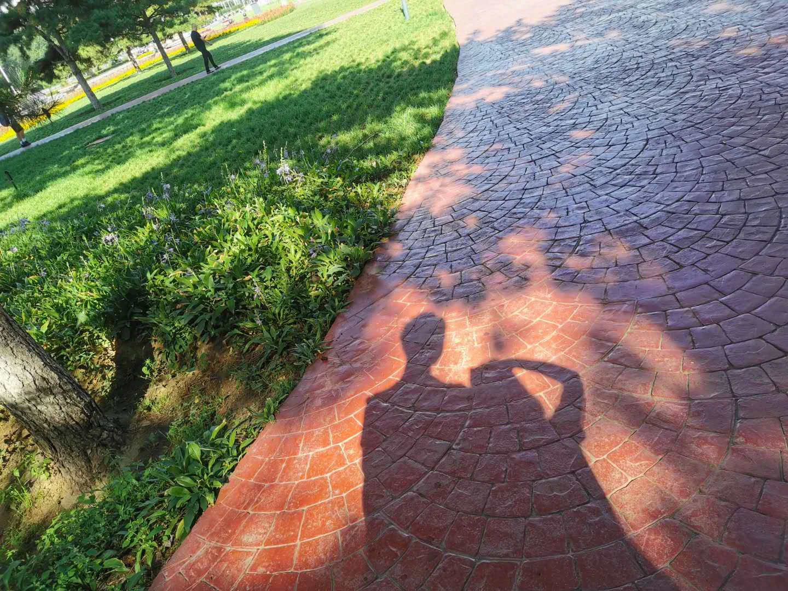
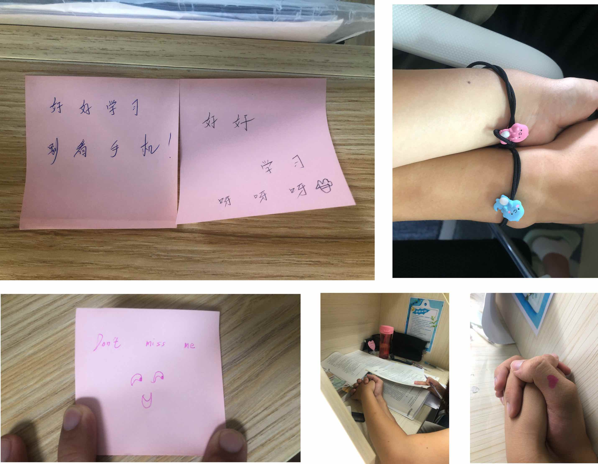
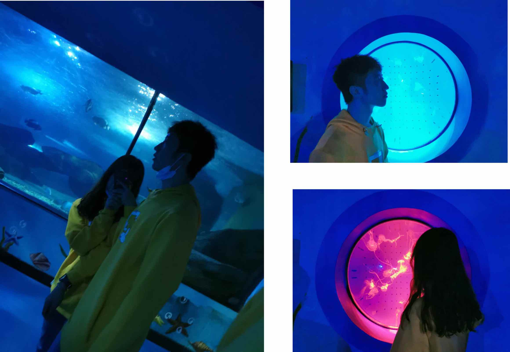

* 所謂愛，就是那一種不會因任何力量而被阻止的力量 *

# 相识

这一年的五月十四号，一个毫无征兆打完篮球的傍晚，在袁记串串香遇到了你，当时没有想到后来我们一起经历这么多

紧接着就是就是我暑假回来找你啦，还记得这些画面嘛，我们第一次吃的牛肉面，第一次去看的电影，第一次牵起的手，第一次合照，好多好多的第一次...

不管做什么都喜欢牵的紧紧的手，这个暑假好快乐呀～

接下来发生了什么呢就是我们正式在一起啦！！！

那时候记得你好喜欢让我背着，我也很喜欢背着你，真的好幸福。谢谢可以让我遇见这么好的你 💖

