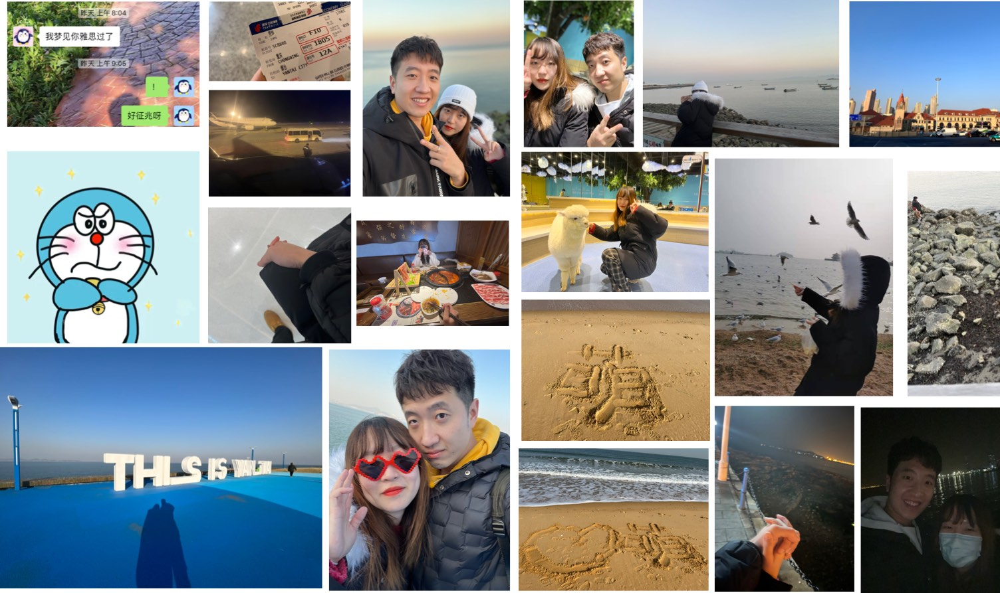
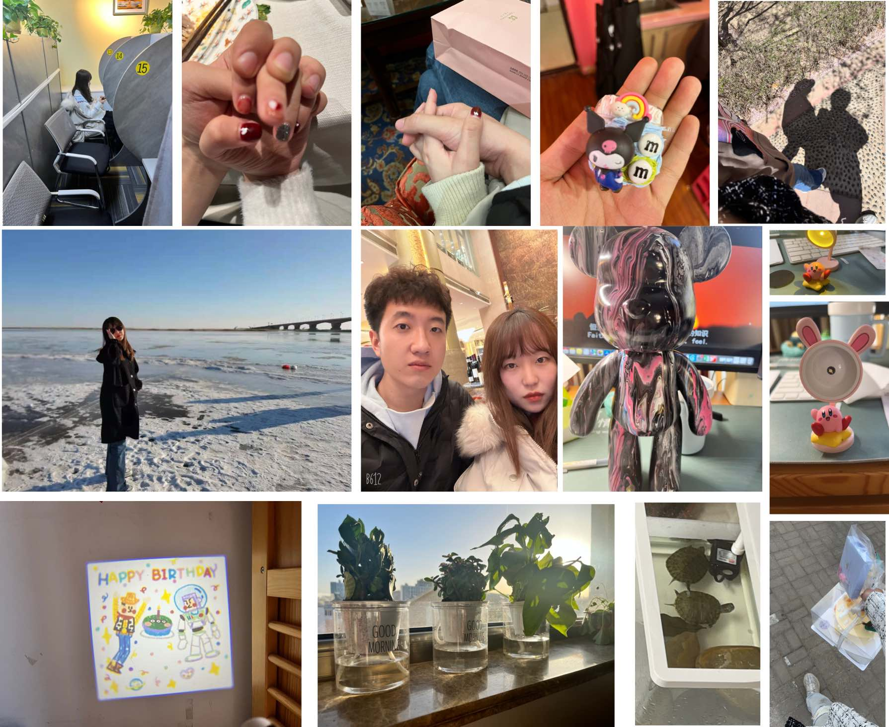
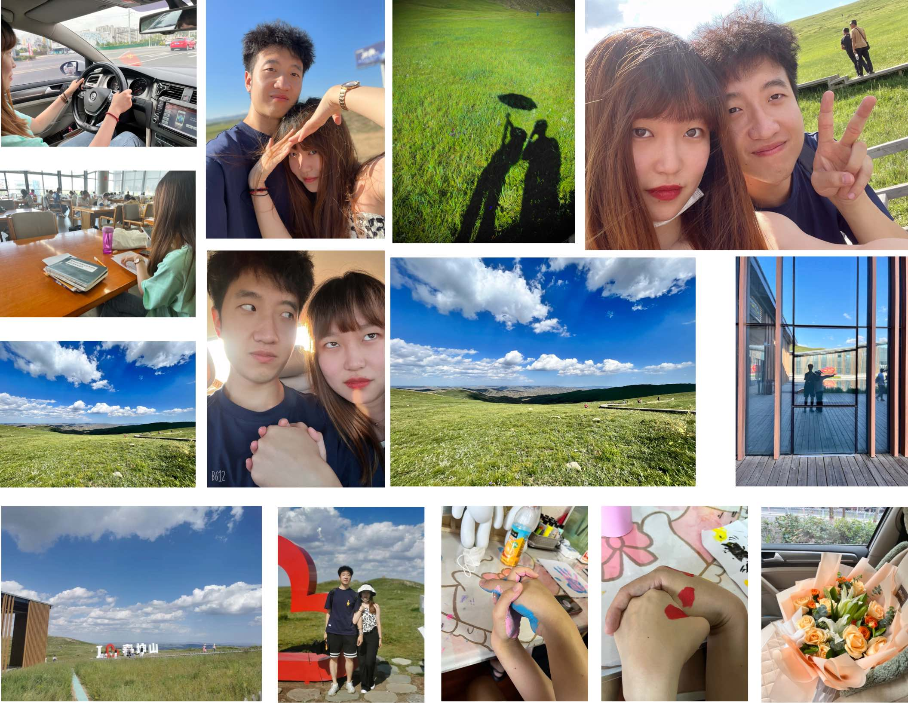

我们在一起两年啦，这一年我们过的非常愉快，疫情的阴霾似乎终于要结束了，这一年里发生了好多事，我考下来了雅思，拿到了驾照，我们的异地恋从 *渝烟* 正式变成了*港烟*...等等等等，总之，两周年愉快啦！

## 烟台跨年

记得当时雅思这件事非常神奇，当时我都考的迷茫了，你的神奇梦境突然告诉我要过了，结果第二天就真的过啦！果断当时就买机票去烟台找你，本来应该10月就考完去找你玩的，结果一考考到了12月。来了烟台刚好你还是考试周，还在忙于期末复习，所以我们就一边复习一边吃吃喝喝度过了那几天。

我记忆犹新的是，当时坐着那个机场大巴，耳机循环播放着陶喆的*天天*，感觉心情非常的甜蜜，当时见到你喜悦的心情无法言喻。

在烟台跨年之后，第二天我陪着你去了青岛，你正式开始了你的考研复习之路，送你到了机构之后，我们晚上去了夜里的栈桥，夜里看海，深夜相爱，甚是浪漫。

## 又是新的一年

很快又要到了过年的时候啦，因为疫情的关系这个寒假格外的漫长，等你从青岛回来之后，我们的生活主旋律就是自习室学习了。我们一起从冬天到了春天。

在今年情人节，我们一起开开心心的度过了，记得我们去吃了哈根达斯，又去吃了香格里拉。

接着就是疫情无尽的封锁，每天在家就是做核酸，过了好久才解封。我们还一起去做了DIY，做了手机壳，还有这两只龟龟。

看这个流体熊，真的好美呀，你可真是一个心灵手巧的仙女呢。

在这几个月里，我拿到了驾照，也毕业了。所以当然就来找你啦，回来时间虽然不长，但是我们也有了很多美好的记忆。我们去了老包头、小白河、马鞍山等等这些地方，还见证了你的实战，哈哈哈，一个敢开一个敢坐。

除了这些欢乐之外，我们当然也有在好好学习，只要我们在一起，做什么都有意思。

最后的最后就是离别啦，我拿到了签证就要去香港，分开总是很不舍很不舍，我记得你因为怕难过，都没有出来见我。所以只好悄悄的把美丽的花花送给你喽！
