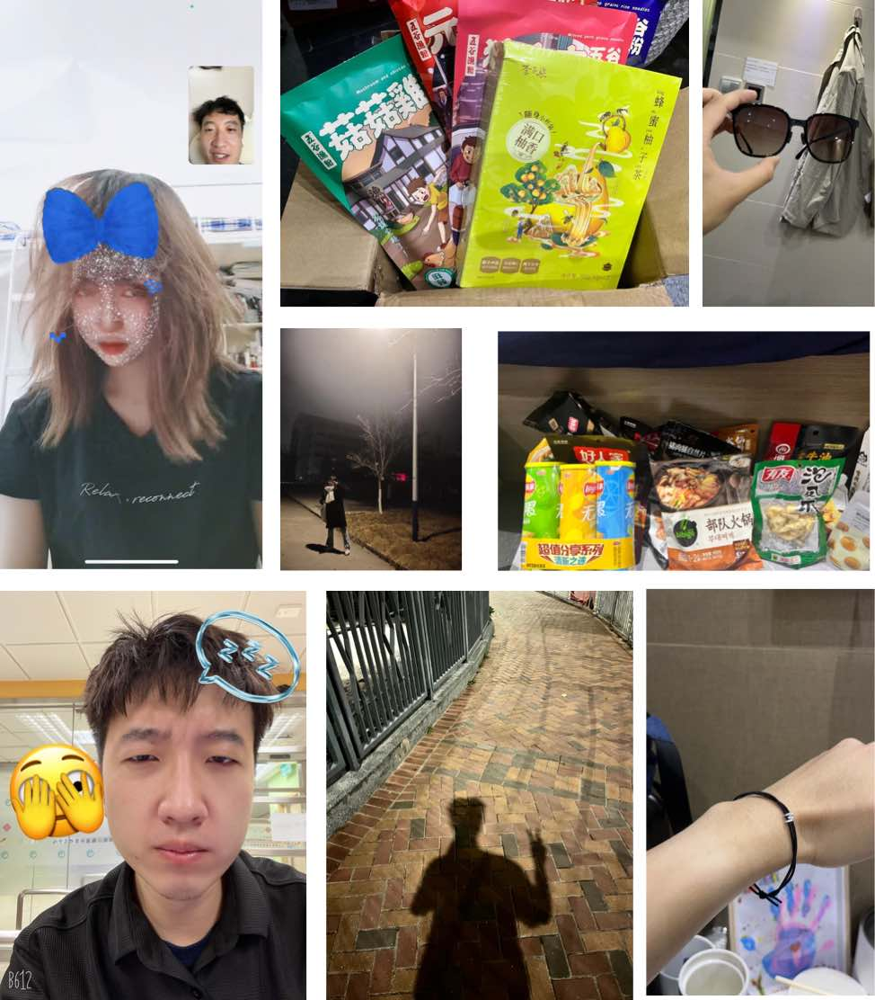
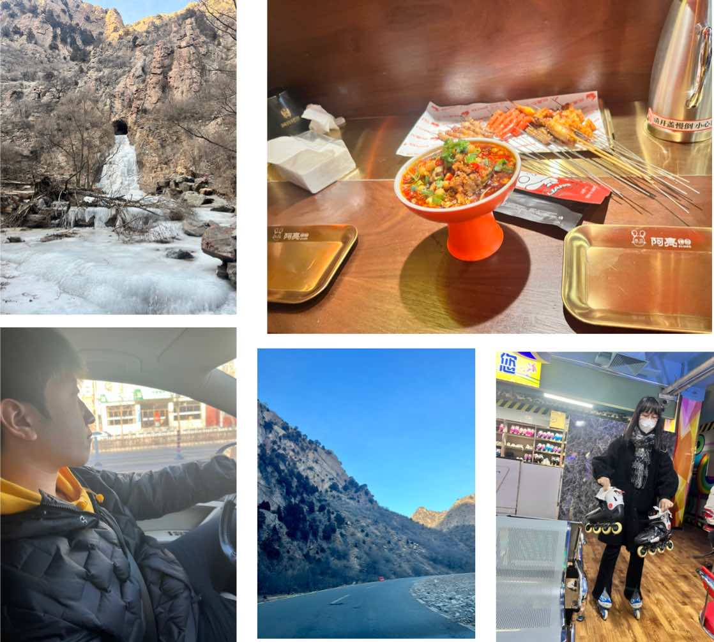
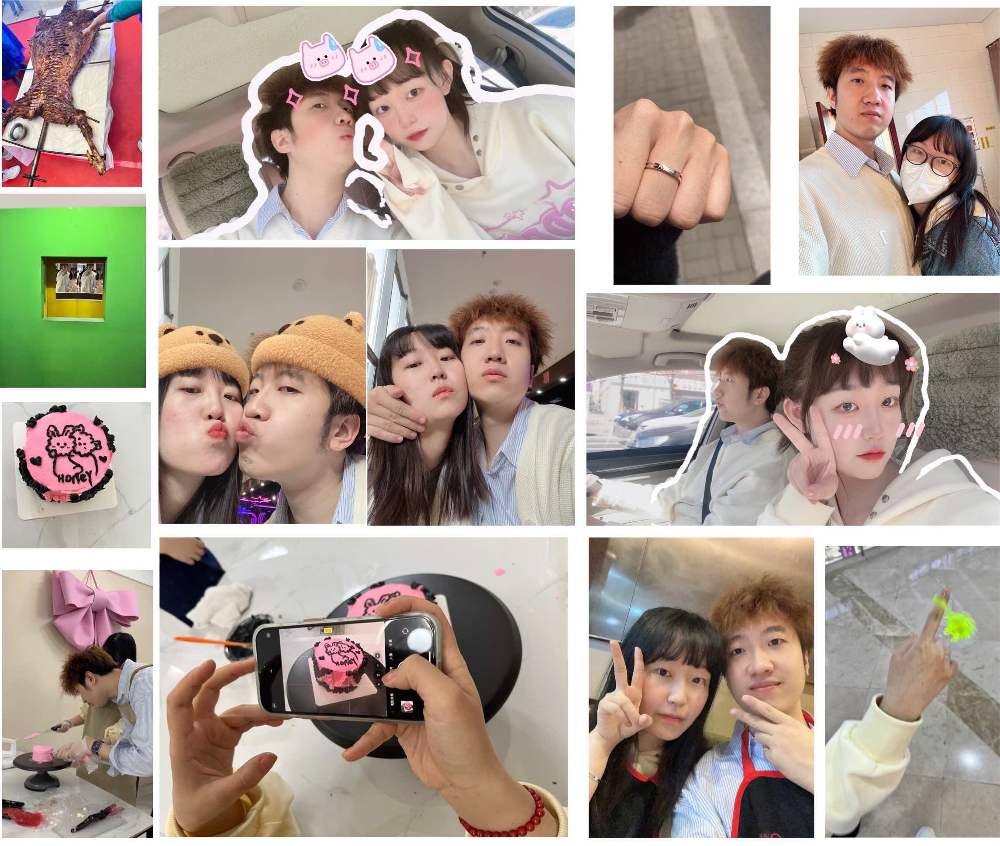
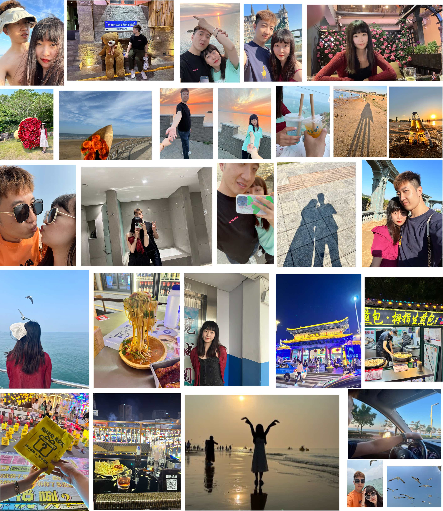
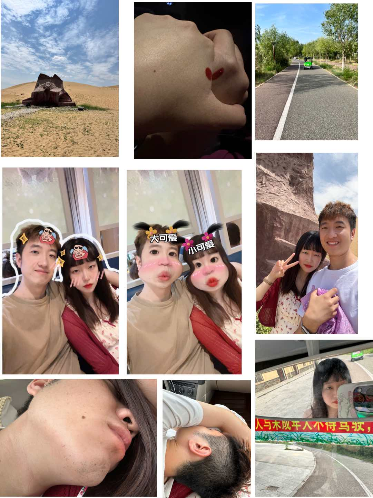

当当当，我们在一起三年喽，这一年里终于要走出疫情的阴影，我也没有像一开始想的那样子真的被关在香港回不来，总之呢，这一年里还是很开心很幸福的

## 异地恋

因为疫情的关系，我没有办法离开香港，所以我们直到过年都是异地恋，不过这也不影响我们的感情，即使是异地我们也能有很多欢乐。记得刚去香港时候，你给我买了好多好多好吃的，幸好很快就解封了，能够回去见你

# 过年啦
因为疫情的关系，这次回家的时间非常短暂，比较特别的记忆就是我们去看了传说中的冰瀑布，我们也第一次解锁了一起滑旱冰这个活动，虽然我滑得甚是笨拙，不忍直视。这一次的新年过的格外的快，感觉刚开始就结束了。

## 春游
嘿嘿嘿，很快就到了四月，我又回来找你玩啦！我们这一次有好好的玩，我们又去做了一个小蛋糕，去逛了包头科技馆，我还参与到了烤全羊，我们发现东河的维多利那家地下的美食，拍了好多美美的照片，在一起的时间真的好开心好开心！

## 你的毕业季

当然，这一年里最最最难忘的当然就是你的毕业旅行啦，想一想仿佛就像是在昨天，想念那个时候。咱俩的Volg我都放在这里啦，[这是你剪的视频](https://aimmeng-life.wistia.com/medias/wy36w7n35h), [这个是我剪的视频](https://aimmeng-life.wistia.com/medias/vlp7ybfbqx)。我现在都还清晰的记着这次旅行的好多事情，半夜给你买盆，咱们去威海小吃街喝酒，哈哈哈哈，想想都好开心呀，此处应有BGM属于我们的[**独家记忆**](https://music.163.com/#/song?id=37899973)。

## 端午节

结束毕业旅行不久，我就回包头找你啦，每次见面真的感觉时间都好快呀，珍惜和你在一起的每一分每一秒，以后结束异地了我也会好好的珍惜和你在一起的每一分每一秒，真的好爱你呀。这次端午节咱们去了传说中的沙泉，结果没有个啥哈哈哈哈，回去路上我困的直接趴你身上睡着了。我们之后还去了南海开车车，结果你趁我不注意开着就跑了，我可是一通追呀，经典追车环节。

